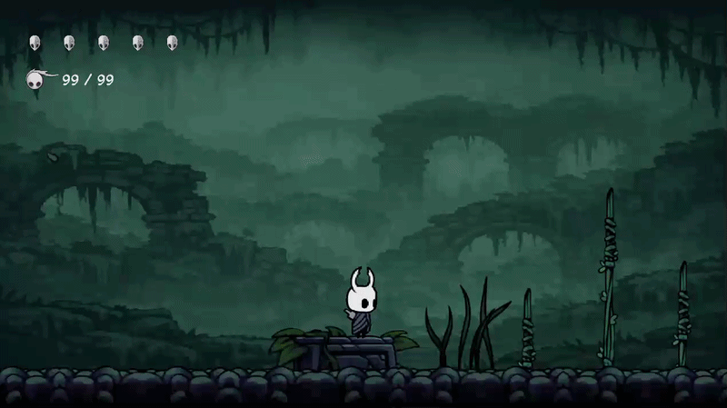

# 🗡️ Hollow Knight — LibGDX Edition

<p align="center">
  <a href="https://libgdx.com/"></a>
  <a href="https://www.java.com/"></a>
  <a href="https://gradle.org/"></a>
<a href="LICENSE"></a></p>
<p align="center">
  A fan-made recreation of <b>Hollow Knight</b>, built from scratch in Java using the
  <a href="https://libgdx.com/">LibGDX</a> framework.
</p>

<p align="center">
  
</p>

---

## 📖 About the Project

This is a personal, non-commercial fan project that reimagines the core mechanics of
**Hollow Knight** using the LibGDX game framework. It was built as a learning exercise
in 2D game development — including custom animation handling, tile-based level design
with Tiled Maps, an enemy AI system, an audio/music manager with crossfading, and a
JSON-based save/profile system.

> ⚠️ **Disclaimer:** This is a fan-made project created for educational purposes only.
> *Hollow Knight* and all related characters, names, and assets are trademarks of
> [Team Cherry](https://www.teamcherry.com.au/). This project is not affiliated with,
> endorsed by, or connected to Team Cherry in any way.

## ✨ Features

- 🎮 2D platformer movement — run, jump, dash, and airborne states
- ⚔️ Combat system with slash animations and a soul/focus mechanic
- 🧟 Multiple enemy types, each with their own AI and animation sets:
    - **False Knight** — multi-phase boss with mace slams, jump attacks, stun & shockwave
    - **Husk Hornhead**, **Mosquito**, **Mosscreep**, **Crystal Guardian**
- 🗺️ Tile-based levels built with [Tiled](https://www.mapeditor.org/) (`env1`, `env2`)
- 🎨 Frame-based sprite-sheet animations rendered via LibGDX's `SpriteBatch`
- 🔊 Full audio system — sound effects per action/enemy, plus background music with fade in/out
- 💾 Multi-slot save system (4 save slots) with a persistent JSON player profile
- ⚙️ Configurable audio, video, and key-binding settings, saved between sessions
- 🏆 Achievements screen
- 🖥️ Cross-platform desktop build (Windows / Linux / macOS via LWJGL3)

## 🕹️ Controls

Default key bindings (configurable in-game via the Settings screen):

| Action | Key        |
|--------|------------|
| Move   | Arrow Keys |
| Jump   | `Z`        |
| Attack | `X`        |
| Dash   | `C`        |
| Focus  | `A`        |
| Pause  | `Esc`      |

## 🛠️ Tech Stack

- **Language:** Java 17
- **Framework:** [LibGDX](https://libgdx.com/)
- **Build Tool:** Gradle (wrapper included)
- **Map Editor:** [Tiled](https://www.mapeditor.org/) (`.tmx` maps)
- **Platforms:** `core` (shared logic), `lwjgl3` (desktop)

## 🚀 Getting Started

### Prerequisites

- [JDK 17+](https://adoptium.net/) installed
- Git

### Clone the repository

```bash
git clone https://github.com/rez4-4hm4d1/Hollow-Knight-LibGDX.git
cd Hollow-Knight-LibGDX
```

### Run the game (from source)

```bash
./gradlew lwjgl3:run
```

### Build a runnable JAR

```bash
./gradlew lwjgl3:jar
```

The output jar (including assets and dependencies) will be located at:

```
lwjgl3/build/libs/HollowKnightProject-<version>.jar
```

### ▶️ Download & Play

Grab the latest ready-to-play `.jar` file from the
[**Releases**](../../releases) page and run it with:

```bash
java -jar <file name>.jar
```

> **Note (macOS):** if the window doesn't open, run it with:
> `java -XstartOnFirstThread -jar <file name>.jar`
## 🤝 Contributing

Contributions, issues, and feature requests are welcome — feel free to open a
[pull request](../../pulls) or check the [issues page](../../issues).

> ⚠️ Note: since asset paths are matched by exact case inside a JAR (even on Windows),
> make sure any new asset filename in the code matches the real file's capitalization.

## 📄 License

This project's **original source code** is distributed under the MIT License — see the
[LICENSE](LICENSE) file for details. This does not extend to any third-party assets
resembling *Hollow Knight* IP, which remain the property of Team Cherry.

## 🙏 Acknowledgements

- [Team Cherry](https://www.teamcherry.com.au/) — for creating the original *Hollow Knight*, the inspiration behind this project
- [LibGDX](https://libgdx.com/) — the game framework powering this project
- [gdx-liftoff](https://github.com/libgdx/gdx-liftoff) — used to scaffold the project

---

<p align="center">Made with ❤️ and a lot of ☕ using LibGDX</p>
